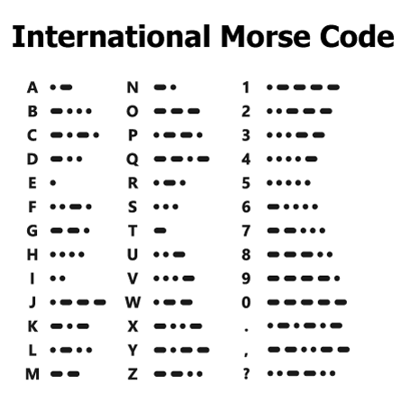

# Morse Code Kata

The Morse code encodes every character as a sequence of "dots" and "dashes". For example, the letter A is coded as ·−, letter Q is coded as −−·−, and digit 1 is coded as ·−−−−. The Morse code is case-insensitive, traditionally capital letters are used. When the message is written in Morse code, a single space is used to separate the character codes and 3 spaces are used to separate words. For example, the message HEY JUDE in Morse code is ···· · −·−−   ·−−− ··− −·· ·.

NOTE: Extra spaces before or after the code have no meaning and should be ignored.

In addition to letters, digits and some punctuation, there are some special service codes, the most notorious of those is the international distress signal SOS (that was first issued by Titanic), that is coded as ···−−−···. These special codes are treated as single special characters, and usually are transmitted as separate words.

Your task is to implement a function that would take the morse code as input and return a decoded human-readable string.

```
decodeMorse ".... . -.--   .--- ..- -.. ."
--should return "HEY JUDE"
```

All the test strings would contain valid Morse code, so you may skip checking for errors and exceptions. In C#, tests will fail if the solution code throws an exception, please keep that in mind. This is mostly because otherwise the engine would simply ignore the tests, resulting in a "valid" solution.



[Original Kata from Code wars](https://www.codewars.com/kata/54b724efac3d5402db00065e)